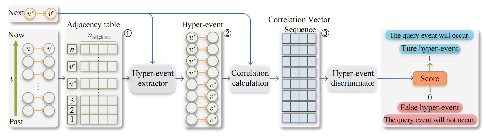
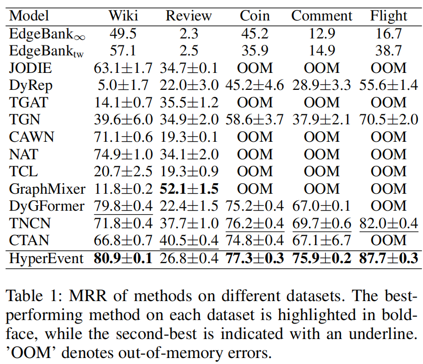
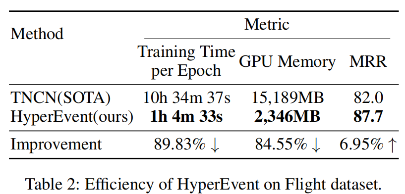

## HyperEvent: Learning Cohesive Events for Large-scale Dynamic Link Prediction


[arxiv link](https://arxiv.org/abs/2507.11836)

**Abstract:** Dynamic link prediction in continuous-time dynamic graphs is a fundamental task for modeling evolving complex systems. Existing node-centric and event-centric methods focus on individual interactions or atomic states, failing to capture the structural cohesion of composite hyper-events—groups of causally related events. To address this, we propose HyperEvent, a framework reframing dynamic link prediction as hyper-event recognition. Central to HyperEvent is the dynamic construction of an association sequence using event correlation vectors. These vectors quantify pairwise dependencies between the query event and relevant historical events, thereby characterizing the structural cohesion of a potential hyper-event. The framework predicts the occurrence of the query event by evaluating whether it collectively forms a valid hyper-event with these historical events. Notably, HyperEvent outperforms state-of-the-art methods on 4 out of 5 datasets in the official leaderboard. For scalability, we further introduce an efficient parallel training algorithm that segments large event streams to enable concurrent training. Experiments validate HyperEvent's superior accuracy and efficiency on large-scale graphs.  Among which HyperEvent achieves a 6.95\% improvement in Mean Reciprocal Rank over state-of-the-art baseline on the large-scale Flight dataset while utilizing only 10.17\% of the training time. 
### Datasets
Supports [TGB datasets](https://tgb.complexdatalab.com/docs/leader_linkprop/):
- `tgbl-wiki-v2`
- `tgbl-review-v2`
- `tgbl-coin-v2`
- `tgbl-comment`
- `tgbl-flight-v2`
  
Datasets are **automatically downloaded** when running the code with internet access.
### Training & Evaluation
Basic execution use hyperparameters(reproduce table 1) in `config_tgb.yaml`:
```
python train_evaluation_tgb.py --dataset tgbl-wiki
```
Custom parameters in terminal:
```
python train_evaluation_tgb.py --dataset tgbl-wiki --num_neighbor 50
```
### After code execution, the following files will be created to automatically record the results.
- `logs/`: Training logs
- `adjtables/`: Adjacency tables
- `models/`: Saved model checkpoints
- `results/`: Evaluation results (CSV format)
### Results
  
### Our experimental environment
- Windows 10
- Python 3.12.4
- PyTorch 2.3.1+cu121
- tgb
### Our hardware
- CPU: Intel Core i7-14700KF 
- RAM: 64 GB
- GPU: NVIDIA GeForce RTX 4090 (24GB VRAM)
